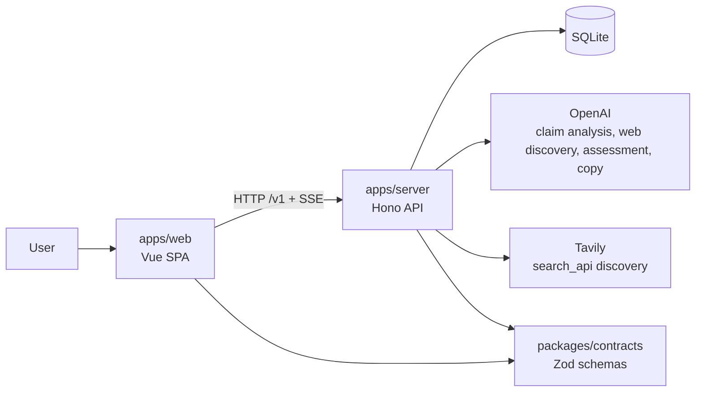

# Architecture Overview

TrustTrace is a Bun workspace monorepo with three active packages.

```txt
apps/web             Vue 3 SPA
apps/server          Hono/Bun API service
packages/contracts   Shared Zod HTTP/SSE contracts
```

## Container view



## Boundary responsibilities

- **Web** owns presentation, routes, local preferences, frontend view models, runtime response validation, and DTO-to-view-model mapping.
- **Server** owns request validation, persistence, source discovery selection, URL safety, extraction, ranking, evidence assessment, deterministic synthesis, and progress events.
- **Contracts** owns only shared HTTP/SSE wire schemas and inferred DTO types.

## External providers

- OpenAI supports claim analysis, LLM web discovery (`llm_web`), source assessment, and result copy.
- Tavily supports search API discovery (`search_api`).
- SQLite stores check records, progress events, claim analysis, input extraction, provider calls, source extraction records, and source evaluations.

Provider output never bypasses backend evidence verification.

## Data flow summary

1. Web sends `POST /v1/checks` with input and `discoveryStrategy`.
2. Server persists a check record, starts the evidence pipeline, and returns the initial progress state plus an SSE URL.
3. Web follows progress through SSE and falls back to polling if the stream is unavailable or lost.
4. Server discovers candidate URLs, validates/fetches/extracts sources, evaluates evidence, computes the band, persists results, and emits terminal progress.
5. Web validates backend JSON with shared schemas before mapping DTOs into frontend types.
